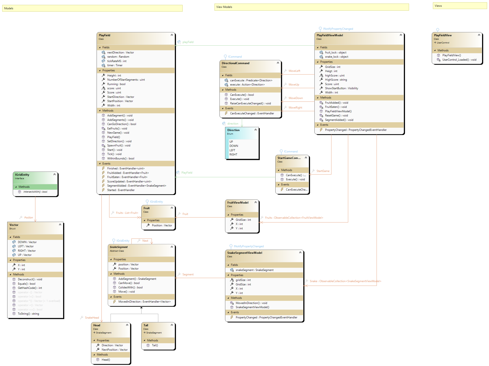

# WPF-Snake

Dieses Projekt ist eine Abgabe die im Rahmen der Programmiervorlesung an der HNU für GPM1-2025 entstanden ist.

## Spielkonzept

Das Spiel ist dem klasischen Snake nachempfunden.

- Der Spieler spielt eine Schlange die aus Blöcken besteht.
- Wenn die Schlange in eine Wand oder sich selbst bewegt ist das spiel vorbei.
- Wenn die Schlange eine Frucht isst, wird sie länger und der Score erhöht sich.

## WPF
Die Visualiserung wird über WPF in MVVM-Struktur realisiert.
- [Views](Snake/Views) enthält alle verwendeten Views (aktuell nur eine)
- [ViewModles](Snake/ViewModels) enthält die Verbindungsklassen welche ein Interface bereitstellen womit die Visuellen komponenten an die unterliegenden Datenlage gebunden werden können.
- [Models](Snake/Models) enthält die tatsächliche Datenlage und Spiellogik

Updates der Werte werden über Events von den Models über die ViewModels bis zu den Views propagiert. Input wird über Commands in den ViewModels gehandhabt, an die sich die Views binden können.
- Richtungs-Inputs werden über vier Separate Bewegungs-Commands and Tasten gebunden
- Das Starten des Spiels wird über einen StartCommand an interne Start-Methoden gebunden
- Alle Werte (z.B. Score, Position verschiedenster Elemente etc.) werden über Events (konkret das Event des INotifyPropertyChanged Interfaces) zur View propagiert.
- Änderungen in Richtung View geschehen nur über Events. Änderungen in Richtung Model werden über Methoden-Aufrufe getätigt.

## Steuerung
Bewegung ist über WASD oder die Pfeiltasten möglich.
Das Spiel kann durch den Startknopf oder SPACE gestartet werden.

